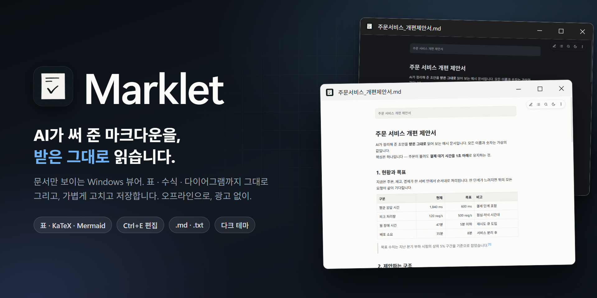
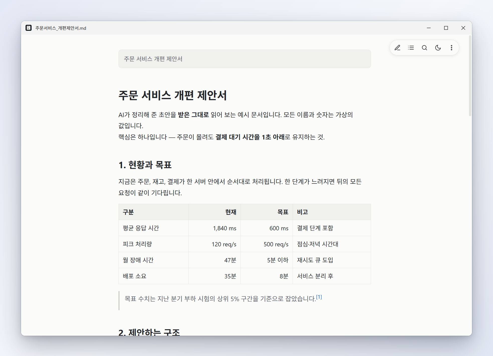
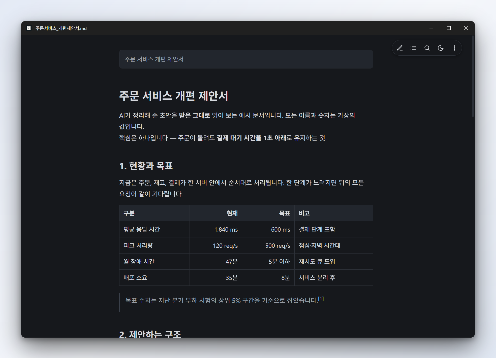
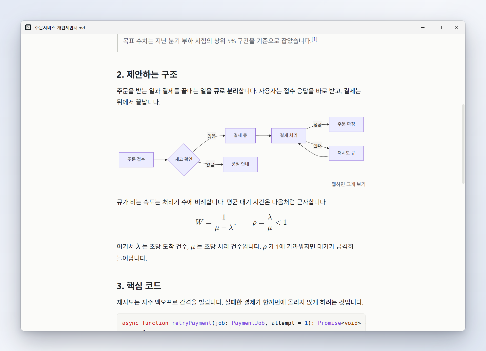
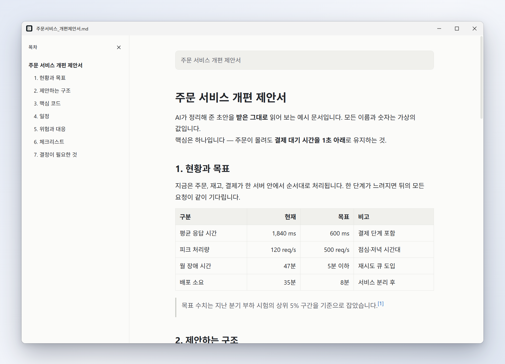
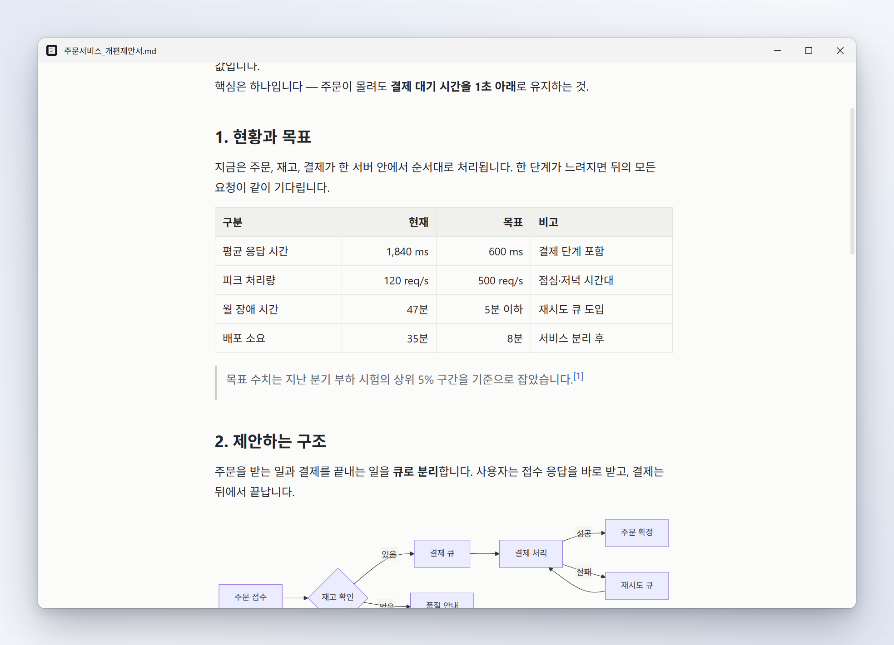
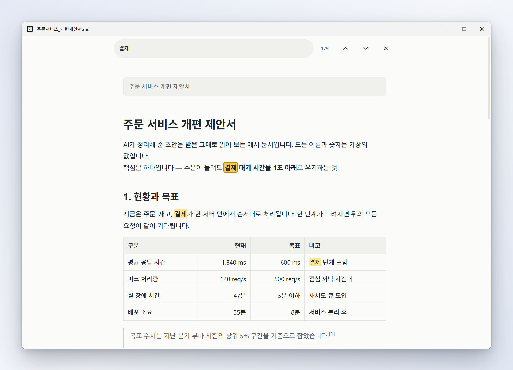
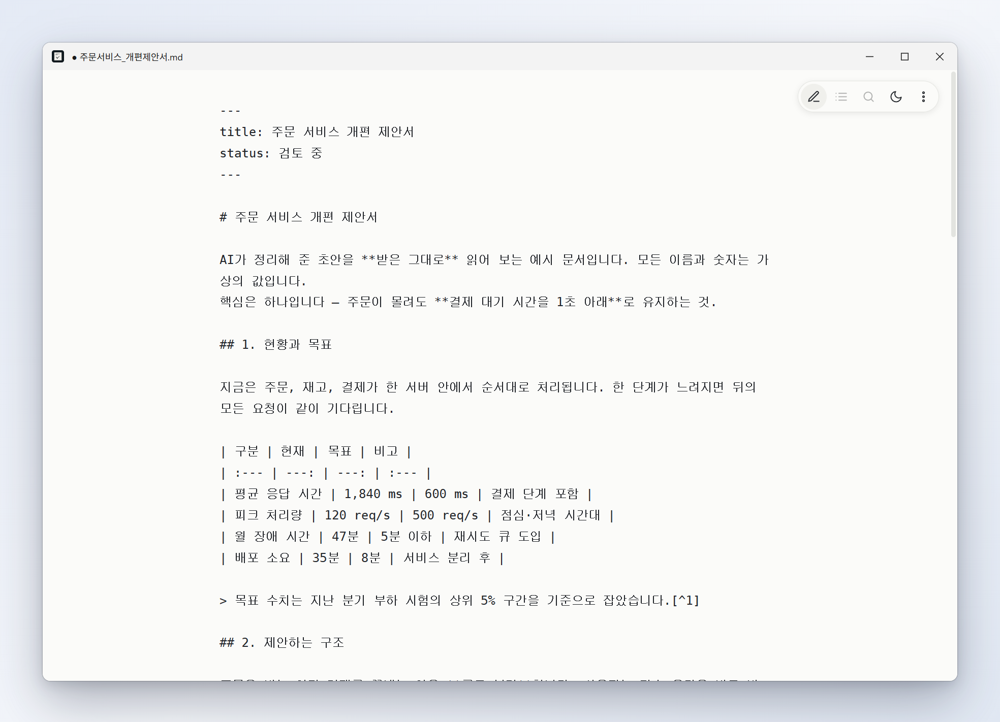

<h1 align="center">
  
</h1>

<p align="center">
  <a href="https://github.com/bellx3/marklet/releases/latest"><b>⬇ Windows 설치 파일 받기</b></a>
</p>

[](LICENSE)
[](https://github.com/bellx3/marklet/releases)
[](https://electronjs.org/)

> **가볍고 빠른 Windows 데스크톱 마크다운 뷰어**  
> AI가 작성해 준 `.md` 문서를 **받은 그대로** 깔끔하게 열어 읽고 가볍게 고칩니다.  
> 문서는 사용자의 기기를 벗어나지 않으며, 광고나 계정, 원격 추적이 전혀 없습니다.

| 플랫폼      | 상태                          | 배포                                                          |
| :---------- | :---------------------------- | :------------------------------------------------------------ |
| **Windows** | **주력 지원 (10 / 11)**       | [GitHub Releases](https://github.com/bellx3/marklet/releases) |
| Android     | **아카이브 (개발 종료/보류)** | [`archive/android/`](archive/android) 격리 보관               |

---

## 스크린샷

화면에는 문서만 있습니다. 마우스를 움직이면 컨트롤이 떠오르고, 나머지는 단축키로 닿습니다.

<p align="center">
  
  
</p>

<p align="center">
  
  
</p>

<p align="center">
  
  
  
</p>

<sub>예시 문서는 [`docs/sample/`](docs/sample)의 가상 문서입니다.</sub>

---

## 주요 기능

- **문서에만 집중하는 미니멀 UI**: 창에는 불필요한 탭이나 거대한 툴바 없이 오직 문서 본문만 표시됩니다. 마우스를 움직이거나 본문을 탭하면 플로팅 컨트롤(목차 · 검색 · 테마 · 더보기)이 부드럽게 나타납니다.
- **풍부한 마크다운 문법 지원**:
    - GFM 표(Table) 자동 반응형 맞춤
    - Mermaid 다이어그램 렌더링
    - KaTeX 기반 수학 수식 (`$...$`, `$$...$$`)
    - 코드 블록 구문 하이라이트 (highlight.js)
    - 각주(Footnotes), 체크박스(Task lists)
- **로컬 자산 완벽 연동**:
    - 문서와 같은 폴더에 위치한 상대 경로 이미지(``) 자동 로드
    - 로컬 상대 문서 링크(`[참조 문서](./sub/spec.md)`) 클릭 시 해당 파일 즉시 전환
- **인코딩 & 줄바꿈 보존 편집 (`Ctrl+E` / `Ctrl+S`)**:
    - `Ctrl+E`로 경량 텍스트 편집기로 전환하고 `Ctrl+S`로 저장합니다.
    - 원본 파일의 문자 인코딩(UTF-8, UTF-8 BOM, UTF-16, CP949/EUC-KR)과 줄바꿈(CRLF/LF)을 변경 없이 그대로 보존합니다.
    - 임시 파일 작성 후 원자적 교체(Atomic rename)로 저장 중 유실 위험을 방지합니다.
- **`.txt` 일반 텍스트 열람**:
    - 일반 텍스트 파일도 서식 깨짐 없이 원문 그대로 열람 가능하며, `Ctrl+U`로 마크다운 서식 뷰로 전환할 수 있습니다.
- **외부 파일 변경 실시간 감지**:
    - 외부 에디터나 도구에서 파일이 갱신되면 읽던 스크롤 위치를 유지하며 즉각 새로고침됩니다.
    - 미저장 편집본이 있을 때 외부 변경이 발생하면 덮어쓰기 확인 대화상자를 띄워 작업을 보호합니다.
- **목차 도크 (`Ctrl+T`)**:
    - 긴 문서의 제목 헤딩을 분석하여 좌측에 반응형 목차 도크를 표시하고, 현재 읽고 있는 위치를 추적합니다.
- **프라이버시 & 보안 기본값**:
    - 오프라인 우선으로 동작하며 일체의 원격 분석/텔레메트리가 없습니다.
    - 원격 외부 이미지는 기본 차단되어 네트워크를 통한 IP/개인정보 유출을 방지합니다.
- **다크 테마 & 인쇄 (`Ctrl+P`)**:
    - 라이트/다크 테마 전환, 시스템 테마 자동 동기화.
    - 인쇄 시에는 다크 모드 상태여도 가독성을 위해 자동으로 흰색 바탕 스타일로 변환 출력합니다.

---

## 설치 (Installation)

1. [Releases](https://github.com/bellx3/marklet/releases) 페이지에서 최신 `Marklet-Setup-<버전>.exe`를 다운로드하여 실행합니다.
2. 관리자 권한이 필요하지 않으며 현재 사용자 영역에 설치됩니다.

> [!NOTE]
> **Windows SmartScreen 안내**:  
> 현재 오픈소스 비서명 빌드로 제공되므로, 첫 실행 시 Windows SmartScreen의 "알 수 없는 게시자" 알림이 뜰 수 있습니다.  
> **추가 정보 → 실행**을 누르시면 정상 실행됩니다.

### 기본 앱 설정

`.md` 파일을 더블클릭했을 때 Marklet으로 바로 열리도록 설정하려면:

- `.md` 파일 우클릭 → **연결 프로그램** → **다른 앱 선택** → **Marklet** 선택 후 **항상** 클릭.
- 앱 내 **도움말 → 기본 앱으로 설정** 메뉴를 누르면 Windows 기본 앱 설정 창이 열립니다.

---

## 사용법 & 단축키

화면에는 문서만 보이며, 마우스 조작 또는 아래 단축키로 제어할 수 있습니다.

| 단축키                   | 기능                                                   |
| :----------------------- | :----------------------------------------------------- |
| `Ctrl+O`                 | 파일 열기 (창으로 파일을 드래그 앤 드롭해도 열립니다)  |
| `Ctrl+E`                 | 편집 모드 ↔ 마크다운 보기 모드 전환                    |
| `Ctrl+S`                 | 저장 (편집 모드 시)                                    |
| `Ctrl+F`                 | 문서 내 실시간 검색                                    |
| `Ctrl+T`                 | 목차 도크 열기 / 닫기                                  |
| `Ctrl+U`                 | 원문 텍스트 보기 ↔ 마크다운 서식 보기 전환             |
| `Ctrl` + `+` / `-` / `0` | 화면 확대 / 축소 / 기본 크기 (또는 `Ctrl` + 마우스 휠) |
| `F11`                    | 전체 화면 모드 토글                                    |
| `Ctrl+P`                 | 문서 인쇄 (항상 읽기 쉬운 라이트 스타일로 인쇄)        |
| `Ctrl+W` / `Esc`         | 창 닫기 / 열린 검색바 및 목차 닫기                     |
| `Alt`                    | 윈도우 기본 메뉴 막대 표시                             |

---

## 개발 및 빌드 (Development)

### 사전 요구사항

- Node.js 20+
- npm 10+

### 설치 및 실행

```bash
# 의존성 설치
npm install

# 데스크톱 개발 모드 실행 (렌더러 빌드 후 Electron 실행)
npm run dev

# 렌더러 프로덕션 빌드
npm run build

# Windows 설치 패키지(.exe) 생성 (NSIS 인스톨러)
npm run dist
```

생성된 설치 파일은 `release-desktop/Marklet-Setup-<버전>.exe`에 저장됩니다.

### README 이미지 다시 만들기

```bash
npm run docs:images   # 앱을 실제로 띄워 docs/images/ 의 스크린샷과 타이틀 배너를 새로 만든다
```

예시 문서(`docs/sample/`)를 실제 앱으로 그려 Windows 창 틀에 넣습니다. **실제 문서를 캡처하지 마세요** — 경로와 내용이 그대로 공개됩니다.

### 테스트 및 코드 검증

```bash
npm test          # vitest 단위 테스트
npm run typecheck # TypeScript 컴파일 검사
npm run lint      # ESLint 검사
```

---

## 프로젝트 아키텍처

```
marklet/
├── desktop/                  # Electron 메인 프로세스
│   ├── main.cjs              # 창 관리, 메뉴, 파일 I/O, IPC 통신
│   ├── preload.cjs           # contextBridge 격리 API
│   ├── menu.cjs              # 애플리케이션 메뉴 정의
│   ├── text.cjs              # 인코딩 감지 및 원자적 파일 저장 로직
│   └── installer.nsh         # NSIS 윈도우 레지스트리 연결 스크립트
├── src/
│   ├── desktop/              # 데스크톱 렌더러 UI
│   │   ├── main.ts           # 렌더러 진입점
│   │   ├── controls.ts       # 플로팅 컨트롤러
│   │   ├── toc-dock.ts       # 반응형 목차 도크
│   │   └── bridge.ts         # Preload 통신 타입 정의
│   ├── markdown/             # 마크다운 렌더링 코어 파이프라인
│   │   ├── renderer.ts       # markdown-it 엔진 설정
│   │   ├── sanitize.ts       # DOMPurify 살균 및 보안 필터
│   │   ├── math.ts           # KaTeX 수식 플러그인
│   │   ├── mermaid.ts        # Mermaid 다이어그램 렌더러
│   │   └── highlight.ts      # highlight.js 구문 강조
│   └── styles/               # 테마 및 컴포넌트 스타일시트
├── docs/                     # 프로젝트 문서 및 에셋
│   └── images/               # README 쇼케이스 이미지
└── archive/                  # 이전 플랫폼 아카이브
    ├── android/              # 이전 Capacitor 안드로이드 네이티브 소스
    └── scripts/              # 안드로이드 전용 빌드/배포 스크립트
```

### 보안 아키텍처

- **Renderer Sandbox**: 렌더러 프로세스는 `sandbox: true` 및 `contextIsolation: true`로 보호되며, Node.js 네이티브 API에 직접 접근할 수 없습니다.
- **안전한 IPC & 스킴 격리**: 파일 열기 및 저장은 `preload.cjs`의 엄격한 화이트리스트 API를 통해서만 이루어집니다.
- **로컬 미디어 보호**: 마크다운 본문에서 참조하는 로컬 파일은 `marklet-local:` 커스텀 프로토콜을 통해 **이미지 확장자만** 선별적으로 렌더러에 제공됩니다.
- **외부 링크 차단**: 임의의 URL이나 프로토콜은 앱 내부에서 로드되지 않고 운영체제 기본 브라우저로만 열립니다.

---

## 플랫폼 히스토리 & 아카이브

본 프로젝트는 초기에 Capacitor 기반 Android 앱으로 설계되었으나, 현재는 **Windows 데스크톱 독립형 뷰어**로 집중 전환되었습니다.  
이전 Android 네이티브 코드 및 Google Play 스토어 빌드 스크립트는 [`archive/`](archive) 디렉터리에 안전하게 보관되어 있습니다.

---

## 라이선스 (License)

이 프로젝트는 [MIT License](LICENSE)를 따릅니다.
