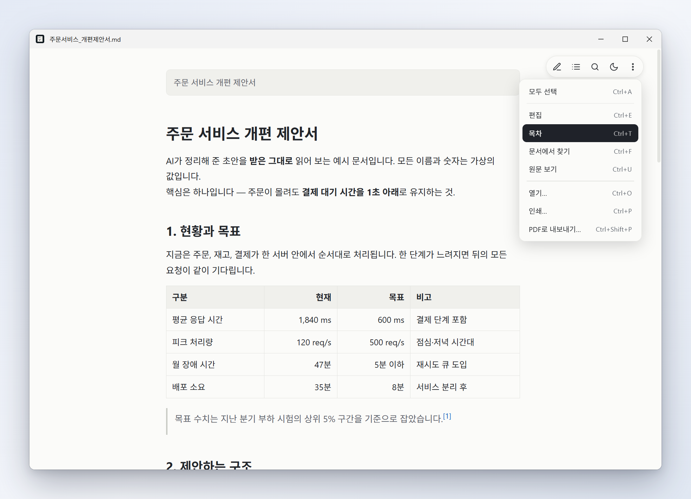

<h1 align="center">
  
</h1>

<p align="center">
  <a href="https://github.com/bellx3/marklet/releases/latest/download/Marklet-Setup.exe"></a>
</p>

<p align="center">
  Windows 10 · 11 (64비트) · 설치 파일 약 4 MB · 무료 · 오픈소스(MIT)<br />
  <sub>관리자 권한 없이 설치됩니다 · <a href="#처음-실행할-때-경고가-뜨면">처음 실행하면 경고가 뜨는 이유</a> · <a href="docs/RELEASE_NOTES.md">변경 내역</a></sub><br />
  <sub>English: a minimal Markdown viewer for Windows — double-click a <code>.md</code> and see just the document. <a href="#english">Details below.</a></sub>
</p>

<p align="center">
  <sub><a href="#설치">설치</a> · <a href="#기능">기능</a> · <a href="#가볍게-뜹니다">속도</a> · <a href="#문서는-이-pc-안에만-있습니다">개인정보</a> · <a href="#단축키">단축키</a> · <a href="#자주-묻는-질문">질문</a> · <a href="#개발과-빌드">개발</a></sub>
</p>

`.md` 파일을 더블클릭하면 **그 문서만 보이는 창**이 열립니다. 에디터를 켜지도, 폴더를 불러오지도 않습니다.
사진 뷰어처럼 화면에는 문서밖에 없고, 마우스를 움직이면 필요한 기능이 떠오릅니다.

- AI(ChatGPT · Claude 등)가 만들어 준 `.md` 를 받자마자 읽고 싶을 때
- 표 · 수식 · Mermaid 다이어그램이 든 문서를 깨지지 않게 보고 싶을 때
- 읽다가 오타만 고치고 싶을 때 — `Ctrl+E` 로 고치고 `Ctrl+S` 로 저장합니다. 파일의 인코딩과 줄바꿈은 그대로 둡니다(한글 CP949 포함)

<table>
  <tr>
    <td colspan="2" align="center">
      <br />
      <sub><b>읽기</b> — 화면에는 문서만 있고, 마우스를 움직이면 우상단에 컨트롤이 떠오릅니다</sub>
    </td>
  </tr>
  <tr>
    <td width="50%" align="center">
      <br />
      <sub><b>다크 테마</b> — 밝게 · 어둡게 · 시스템에 맞춤</sub>
    </td>
    <td width="50%" align="center">
      <br />
      <sub><b>목차</b> — 왼쪽에 붙어 지금 읽는 절을 따라갑니다 (<code>Ctrl+T</code>)</sub>
    </td>
  </tr>
  <tr>
    <td align="center">
      <br />
      <sub><b>다이어그램 · 수식</b> — Mermaid 와 KaTeX 를 그대로 그립니다</sub>
    </td>
    <td align="center">
      <br />
      <sub><b>찾기</b> — 한글 초성으로도 찾습니다 (<code>Ctrl+F</code>)</sub>
    </td>
  </tr>
  <tr>
    <td align="center">
      <br />
      <sub><b>더 보기</b> — 항목마다 단축키가 적혀 있습니다</sub>
    </td>
    <td align="center">
      <br />
      <sub><b>편집</b> — 오타만 고칩니다 (<code>Ctrl+E</code>)</sub>
    </td>
  </tr>
</table>

<sub>예시 문서는 [`docs/sample/`](docs/sample)의 가상 문서입니다.</sub>

<a id="english"></a>

<details>
<summary><b>English</b></summary>

**Marklet** is a minimal Markdown viewer for Windows 10/11 (64-bit). Double-click a `.md` file and you get a window with just the document — no editor, no workspace, no account. The UI is available in Korean and English and follows your Windows language.

- Renders tables, footnotes, task lists, syntax-highlighted code, KaTeX math, Mermaid diagrams and YAML front matter. Shows local images and follows links to other `.md` files.
- Outline dock (`Ctrl+T`), find with Korean initial-consonant search (`Ctrl+F`), light/dark theme, and automatic reload when the file changes on disk.
- Fix a typo with `Ctrl+E` and save with `Ctrl+S` — the file's encoding (UTF-8, BOM, UTF-16, CP949) and line endings are kept as they were. Print preview (`Ctrl+P`) and PDF export with bookmarks (`Ctrl+Shift+P`).
- Small and quick: a ~4 MB installer. Plain documents appear in about 0.13 s through a built-in renderer; documents with math or diagrams are drawn by the system's Edge WebView2.
- Private: no account, ads or telemetry, and no network requests while you read. Remote images are off by default.
- Free and open source (MIT). **Download:** [`Marklet-Setup.exe`](https://github.com/bellx3/marklet/releases/latest/download/Marklet-Setup.exe) — no administrator rights needed. The installer is not code-signed yet, so Windows SmartScreen may warn you: choose *More info → Run anyway*.

</details>

---

## 설치

1. 위의 **Windows용 다운로드**로 `Marklet-Setup.exe` 를 받아 실행합니다. 몇 초면 끝나고, 관리자 권한은 필요 없습니다.
   (WebView2 런타임이 없는 PC 에서만 설치 프로그램이 Microsoft 에서 내려받아 먼저 설치합니다. Windows 11 에는 기본으로 들어 있습니다.)
2. `.md` 파일을 우클릭 → **연결 프로그램 → 다른 앱 선택 → Marklet → 항상**.
   Windows 는 설치 프로그램이 기본 앱을 마음대로 바꾸지 못하게 막아서, 이 한 번은 직접 지정해야 합니다. 앱의 **도움말 → 기본 앱으로 설정…** 이 Windows 설정 창을 바로 열어 줍니다.
3. 이제 `.md` 를 더블클릭하면 됩니다. 앱 창에 파일을 끌어다 놓거나 `Ctrl+O` 로도 열립니다.

제거는 Windows 설정 → 앱에서 합니다. 제거 화면에서 **앱 데이터 삭제**를 고르지 않으면 설정 파일(`%APPDATA%\com.marklet.md.desktop`)이 남습니다.

> [!NOTE]
> **1.0.12 이하(예전 판)를 쓰고 있다면** 새 판을 설치하기 전에 Windows 설정 → 앱에서 예전 Marklet 을 먼저 제거하세요.
> 예전 판의 제거 프로그램은 파일 연결 항목도 같이 지우기 때문에, 새 판을 깐 뒤에 지우면 연결이 풀립니다(풀렸다면 새 판을 다시 설치하면 됩니다).
> 테마 · 확대 · 최근 문서는 새 판이 처음 실행할 때 이어받습니다.

## 처음 실행할 때 경고가 뜨면

설치 파일에 아직 **코드 서명이 없습니다.** 그래서 브라우저와 Windows 가 낯선 파일로 다룹니다.

| 어디서                   | 보이는 것                                       | 하는 일                      |
| :----------------------- | :---------------------------------------------- | :--------------------------- |
| 브라우저 (Edge · Chrome) | 자주 다운로드되지 않는 파일이라는 경고          | 다운로드 항목의 **⋯ → 유지** |
| Windows SmartScreen      | "Windows에서 PC를 보호했습니다" 창              | **추가 정보 → 실행**         |

받은 파일이 릴리즈에 올린 그대로인지는 해시로 확인할 수 있습니다. 기준 값은 [릴리즈 노트](docs/RELEASE_NOTES.md)에 있습니다.

```powershell
Get-FileHash .\Marklet-Setup.exe -Algorithm SHA256
```

소스가 모두 이 저장소에 있으니, 못 미더우면 [직접 빌드](#개발과-빌드)해서 쓰셔도 됩니다.

---

## 기능

**읽기**

- 표(GFM) · 각주 · 체크박스 · 코드 구문 강조 · KaTeX 수식 · Mermaid 다이어그램 · YAML front matter
- 넓은 표는 창 폭에 맞춰 글자 크기를 줄여 보여 줍니다.
- 문서 옆의 그림(``)이 그대로 보이고, 다른 `.md` 로 거는 링크를 누르면 그 문서로 넘어갑니다.
- **목차 도크** (`Ctrl+T`) — 제목이 있는 문서는 왼쪽에 목차가 붙어 읽는 위치를 따라갑니다.
- **찾기** (`Ctrl+F`) — 한글 초성 검색(`ㅈㅁ` → 주문)도 됩니다.
- 라이트 · 다크 · 시스템 테마.
- 다른 프로그램에서 파일을 저장하면 읽던 자리를 지킨 채 자동으로 다시 불러옵니다.
- 파일 메뉴에서 **최근 문서**를 열고, **파일 위치 열기** · **경로 복사**를 합니다.

**고치기**

- `Ctrl+E` 로 편집기로 바꾸고 `Ctrl+S` 로 저장합니다. 파일을 열 때의 인코딩(UTF-8 · BOM · UTF-16 · CP949)과 줄바꿈(CRLF · LF)을 그대로 유지하고, 임시 파일에 쓴 뒤 바꿔치기해서 저장 도중 파일이 깨지지 않게 합니다.
- 저장하지 않은 편집은 창 제목의 ● 로 보이고, 닫기 전에 묻습니다. 편집하는 사이 다른 프로그램이 파일을 바꿨으면 저장할 때 덮어쓸지 묻습니다.

**내보내기**

- `Ctrl+P` 인쇄 미리보기, `Ctrl+Shift+P` PDF 저장. 파일 이름은 문서 이름으로 채워지고, 제목은 PDF 책갈피가 됩니다. 어두운 테마여도 종이용으로 밝게 만들어집니다.
- `.txt` 도 서식 없이 그대로 열립니다(`Ctrl+U` 로 마크다운 서식 보기). 연결 프로그램 목록에만 올라가며, 메모장 같은 기존 기본 앱은 바뀌지 않습니다.
  Marklet 을 `.txt` 의 기본 앱으로 정하면 탐색기에서 `.md` 와 다른 아이콘(파란 바탕의 `TXT`)으로 보입니다.

## 가볍게 뜹니다

Marklet 은 문서에 따라 두 가지 방식으로 그립니다.

| 문서                                                                | 그리는 방식                                           | 글자가 보이기까지¹                                | 메모리¹ |
| :------------------------------------------------------------------ | :---------------------------------------------------- | :------------------------------------------------ | :------ |
| 글 · 표 · 목록 · 코드 · 그림이 든 문서 (대부분)                     | **내장 뷰어** — Edge 엔진(WebView2)을 띄우지 않습니다 | 약 0.13초                                         | 약 50MB   |
| 수식 · Mermaid · SVG 그림이 든 문서, 편집 · 인쇄 · PDF               | 시스템의 WebView2 (Edge 엔진)                         | 약 0.13초에 내장 뷰어가 먼저 보여 주고, 완성은 약 0.8초 | 약 440MB  |

<sub>¹ 이 PC(Windows 11)에서 문서를 연 순간부터 화면에 글자가 보일 때까지, 그리고 문서를 열고 6초 뒤의 메모리(중앙값). PC 마다 다릅니다. 재는 도구는 `scripts/bench-pixels.cjs` · `bench-memory.cjs` 입니다.</sub>

- 800KB 가 넘는 문서, 원격 이미지를 켠 문서, 스크린 리더가 켜져 있을 때도 WebView2 로 그립니다(내장 뷰어는 스크린 리더에 아직 대응하지 않습니다).
- 내장 뷰어만 쓰는 문서는 창을 닫으면 프로세스도 끝납니다. WebView2 로 그린 문서를 닫으면 5분 동안 창 없이 남아 다음 문서를 바로 엽니다 —
  **보기 → 닫은 뒤에도 잠시 준비해 두기**로 끌 수 있고, 5분 안에 문서가 열리지 않으면 스스로 끝납니다.
- **보기 → 로그인할 때 미리 켜 두기**(기본 꺼짐)를 켜면 로그인할 때 창 없이 앱을 띄워 두어 수식 문서도 바로 뜹니다. 대신 로그인해 있는 동안 메모리를 씁니다.
- **보기 → 빠른 보기**를 끄면 모든 문서를 WebView2 로 그립니다(문제가 있을 때 비교용).

## 문서는 이 PC 안에만 있습니다

- **계정 · 광고 · 사용 통계 수집이 없습니다.** 문서를 열고 읽는 동안 외부로 나가는 요청도 없습니다.
  내장 뷰어는 네트워크를 쓰지 않고(문서를 연 동안 열린 소켓 0개 · 자식 프로세스 0개를 확인했습니다), WebView2 로 그리는 창은 시작 인자로 Edge 의 백그라운드 통신(업데이트 · 동기화 · 안전 검사 등)을 끄고
  설정 서비스 · DNS-over-HTTPS 주소는 이름 해석 단계에서 막아 두었습니다. 그 창은 Chromium net-log 로 기록해 확인했습니다 — 문서 내용이 담긴 요청은 0건이고,
  막아 둔 DNS 점검 시도와 Windows 의 프록시 자동 감지용 `wpad` 이름 조회만 보입니다(편집기에서 글을 쳐 맞춤법 검사를 일으켜도 같습니다).
- 문서 속 `` **원격 이미지는 기본으로 불러오지 않습니다.** 자리표시자를 누르거나 **Alt → 보기 → 원격 이미지 불러오기** 를 켜야만 요청이 나갑니다.
- 문서 안의 웹 링크는 기본 브라우저에서 열립니다. 문서가 가리키는 네트워크 경로(`\\서버\공유`)는 열지 않습니다.
- 설치는 현재 사용자 영역(`%LOCALAPPDATA%\Marklet`)과 사용자 레지스트리(HKCU)에만 씁니다. 관리자 권한이 필요 없는 이유입니다.
- WebView2 런타임은 Microsoft 가 따로 배포하고 갱신합니다. 그쪽의 통신은 Marklet 이 하는 것이 아닙니다.

## 단축키

마우스를 움직이면 우상단에 컨트롤이 떠오르고, 그 안의 **⋮** 메뉴(우클릭도 같습니다)와 **Alt** 로 나오는 메뉴 막대에 단축키가 적혀 있습니다.

| 단축키                                    | 기능                                           |
| :---------------------------------------- | :--------------------------------------------- |
| <kbd>Ctrl</kbd> <kbd>O</kbd>              | 파일 열기 (창에 끌어다 놓아도 됩니다)          |
| <kbd>Ctrl</kbd> <kbd>F</kbd>              | 문서에서 찾기                                  |
| <kbd>Ctrl</kbd> <kbd>T</kbd>              | 목차 열기 / 닫기                               |
| <kbd>Ctrl</kbd> <kbd>U</kbd>              | 원문 ↔ 서식 보기                               |
| <kbd>Ctrl</kbd> <kbd>E</kbd>              | 편집 ↔ 보기                                    |
| <kbd>Ctrl</kbd> <kbd>S</kbd>              | 저장 (편집 중)                                 |
| <kbd>Ctrl</kbd> <kbd>P</kbd>              | 인쇄 미리보기                                  |
| <kbd>Ctrl</kbd> <kbd>Shift</kbd> <kbd>P</kbd> | PDF로 내보내기                             |
| <kbd>Ctrl</kbd> <kbd>A</kbd> · <kbd>Ctrl</kbd> <kbd>C</kbd> | 모두 선택 · 복사                 |
| <kbd>Ctrl</kbd> <kbd>+</kbd> / <kbd>-</kbd> / <kbd>0</kbd> | 확대 / 축소 / 원래 크기 (<kbd>Ctrl</kbd> + 휠도 됩니다) |
| <kbd>F11</kbd>                            | 전체 화면                                      |
| <kbd>Esc</kbd>                            | 열려 있는 찾기 · 목차 · 다이어그램 확대를 하나씩 닫기 |
| <kbd>Ctrl</kbd> <kbd>W</kbd>              | 이 창 닫기                                     |
| <kbd>Ctrl</kbd> <kbd>Q</kbd>              | Marklet 끝내기 (열려 있는 창 모두)             |
| <kbd>Alt</kbd>                            | 메뉴 막대 보이기 / 숨기기                      |

## 자주 묻는 질문

**업데이트는 어떻게 하나요?**
자동 업데이트는 없습니다. 새 버전은 위의 버튼으로 다시 받아 실행하면 덮어 설치되고, 설정과 최근 문서는 유지됩니다. 새 버전 알림이 필요하면 이 저장소의 **Watch → Custom → Releases** 를 켜 두세요.

**어떤 파일을 열 수 있나요?**
`.md` `.markdown` `.mdown` `.mkd` 그리고 `.txt` 입니다. 글자 수가 약 400만 자를 넘는 문서는 서식 없이 원문으로 보여 주고(느려지지 않게), 64MB 가 넘는 파일은 열지 않습니다.

**WebView2 가 뭔가요? 꼭 있어야 하나요?**
Edge 가 쓰는 화면 엔진으로, Windows 11 에는 기본으로 들어 있습니다. 글 · 표 · 코드 · 그림만 든 문서는 내장 뷰어가 그리므로 필요 없지만, 수식 · 다이어그램 · 편집 · 인쇄에는 씁니다. 없는 PC 에서는 설치 프로그램이 Microsoft 에서 받아 설치합니다.

**왜 어떤 문서는 조금 늦게 완성되나요?**
수식과 다이어그램은 WebView2 가 그려야 해서, 앱이 막 켜졌을 때는 0.8초쯤 걸립니다(그 사이에도 내장 뷰어가 먼저 글을 보여 줍니다). 완성되기 전에는 스크롤만 됩니다. **보기 → 로그인할 때 미리 켜 두기**를 켜면 이 시간이 줄어듭니다.

**macOS · Linux · Android 는요?**
지금은 Windows 만 지원합니다. 예전에 만든 Android 판은 개발을 접었고, 코드는 저장소 이력(`archive/` 폴더, 커밋 `9ed077f` 까지)에만 남아 있습니다.

**버그나 바라는 점이 있어요.**
[Issues](https://github.com/bellx3/marklet/issues)에 남겨 주세요.

---

## 개발과 빌드

<details>
<summary>소스에서 직접 만들기 · 구조 · 보안 구조 (펼치기)</summary>

### 사전 요구사항

- Rust (stable, MSVC 툴체인) 와 Visual Studio Build Tools(C++)
- Node.js 22.12+ · npm 10+
- WebView2 런타임 (Windows 11 에는 기본으로 있습니다)

### 실행과 빌드

```bash
npm install          # 렌더러 의존성 + Tauri CLI
npm run build        # 렌더러 번들 → Rust 빌드 → 설치 파일(NSIS) : src-tauri/target/release/bundle/nsis/
npm run build:exe    # 실행 파일만 : src-tauri/target/release/Marklet.exe
```

> [!WARNING]
> 실행 중인 `Marklet.exe` 는 덮어쓸 수 없습니다. 빌드 전에 끝내세요(`taskkill /F /IM Marklet.exe`).

Tauri 가 만드는 설치 파일 이름은 `Marklet_<버전>_x64-setup.exe` 입니다. 릴리즈에 올릴 때는 `Marklet-Setup.exe` 로 바꿉니다(다운로드 버튼이 그 이름을 가리킵니다).

### 검증

```bash
npm test             # 렌더러 단위 시험(vitest)
npm run test:rust    # Rust 단위 시험(cargo test)
npm run typecheck    # TypeScript 컴파일 검사
npm run lint         # ESLint 검사
npm run contrast     # 테마 색 대비(WCAG AA) 점검

node scripts/check-native-windows.cjs   # 진짜 창 · 진짜 입력(SendInput)으로 내장 뷰어 점검 20가지 (release 빌드 필요)
node scripts/check-tauri-windows.cjs    # WebView2 창 수명 점검 15가지
```

네트워크 요청이 없다는 것은 WebView2 에 `--log-net-log` 를 줘서 직접 확인할 수 있습니다. `MARKLET_NATIVE=0` 은 내장 뷰어를 끄고 모든 문서를 웹 창으로 그리게 합니다:

```powershell
$env:MARKLET_NATIVE = '0'
$env:WEBVIEW2_ADDITIONAL_BROWSER_ARGUMENTS = '--log-net-log=C:\temp\net.json'
.\Marklet.exe 문서.md
```

### 문서화 도구

```bash
npm run notices       # 번들에 들어간 오픈소스(npm · Rust 크레이트)를 모아 THIRD_PARTY_NOTICES.txt 를 다시 만든다
npm run icons         # src-tauri/icons/txt.ico (.txt 문서 아이콘)를 다시 만든다
npm run docs:images   # 실제 앱을 띄워 docs/images/ 의 스크린샷과 타이틀 배너를 새로 만든다(실행 파일이 먼저 있어야 한다)
```

예시 문서(`docs/sample/`)를 실제 앱으로 그려 Windows 창 틀에 넣습니다. **실제 문서를 캡처하지 마세요** — 경로와 내용이 그대로 공개됩니다.
속도 · 메모리는 `scripts/bench-*.cjs` 로 잽니다. 점검 · 측정 스크립트는 설정과 웹뷰 데이터를 임시 폴더에 써서 이 PC 의 진짜 설정을 건드리지 않습니다. 설계와 측정 기록은 [`src-tauri/README.md`](src-tauri/README.md) 에 있습니다.

### 구조

```
marklet/
├── src-tauri/                  # Rust 앱 (Tauri)
│   ├── src/
│   │   ├── main.rs · app.rs    # 시작 · 창 · 문서 · 저장 · 파일 감시
│   │   ├── native.rs           # 내장 뷰어 창 ↔ 앱 (열기 · 웹 창으로 넘기기)
│   │   ├── preview/            # 내장 뷰어: 마크다운 해석 → 배치(DirectWrite) → 그리기(Direct2D) · 입력 · 찾기
│   │   ├── cmd.rs · menu.rs    # 렌더러가 부르는 명령 · 메뉴 (글은 strings.rs)
│   │   ├── text.rs · links.rs  # 인코딩 · 줄바꿈 / 문서 안 링크 → 열 파일 (네트워크 경로 차단)
│   │   └── state.rs · webview.rs · autostart.rs
│   ├── icons/                  # 앱 아이콘 · txt.ico
│   ├── installer-hooks.nsh     # 설치기 레지스트리 연결 (.md · .txt)
│   └── tauri.conf.json
├── src/                        # 웹 창이 쓰는 렌더러 (TypeScript)
│   ├── desktop/                # 진입점 main.ts, 떠오르는 컨트롤, 목차 도크, 메뉴
│   ├── markdown/               # 렌더링 코어: markdown-it · DOMPurify · KaTeX · Mermaid · highlight.js
│   ├── services/ · utils/      # 문서 안 검색(초성 포함) · 설정 · 보조 함수
│   ├── i18n/ · styles/ · app/  # 한국어 · 영어 문자열 / 테마와 스타일 / 화면 부품
├── desktop.html                # 렌더러 진입 HTML (CSP 포함)
├── docs/                       # 릴리즈 노트, README 이미지, 예시 문서
├── scripts/                    # 점검 · 측정 · 고지문 · 아이콘 생성 도구
└── THIRD_PARTY_NOTICES.txt     # 오픈소스 고지문 (설치 파일에 실린다)
```

### 보안 구조

- **웹 창은 가둔다** — WebView2 창이 Rust 에 부를 수 있는 것은 이벤트 듣기와 앱이 내민 명령(문서 열기 · 저장 · 설정 등)뿐입니다(`src-tauri/capabilities/default.json` · `cmd.rs`).
- **엄격한 CSP** — `desktop.html`: 스크립트는 번들만(`script-src 'self'`), `connect-src` 는 앱 안 주소뿐입니다. 외부로 닿을 수 있는 길은 `https:` 그림 하나뿐이고, 그 그림은 기본으로 불러오지 않습니다.
- **살균** — 마크다운이 만든 HTML 은 DOMPurify 허용 목록을 거칩니다(`src/markdown/sanitize.ts`). 내장 뷰어는 HTML 을 실행하지 않고 글자로 보여 줍니다.
- **로컬 그림** — 문서가 가리킨 그림은 `marklet-local` 스킴으로 **그림 확장자만** 내줍니다(`main.rs`). 내장 뷰어는 Windows 의 이미지 디코더(WIC)로 풉니다.
- **링크** — 웹 주소는 기본 브라우저로만 열고, 문서 안 상대 링크는 문서 파일(`.md` `.txt` 등)만 엽니다. 네트워크 경로(UNC)는 열기 전에 거릅니다(`links.rs`).
- **WebView2 시작 인자** — Edge 의 백그라운드 통신을 끄고 설정 서비스 · DNS-over-HTTPS 주소는 이름 해석 단계에서 막습니다(`webview.rs`).

</details>

## 라이선스

[MIT License](LICENSE)입니다. 설치 파일에 들어가는 오픈소스 구성요소(npm 59개 · Rust 크레이트 267개)의 고지는 [`THIRD_PARTY_NOTICES.txt`](THIRD_PARTY_NOTICES.txt)에 있고, 앱에서는 **도움말 → 오픈소스 라이선스** 로 열 수 있습니다.
