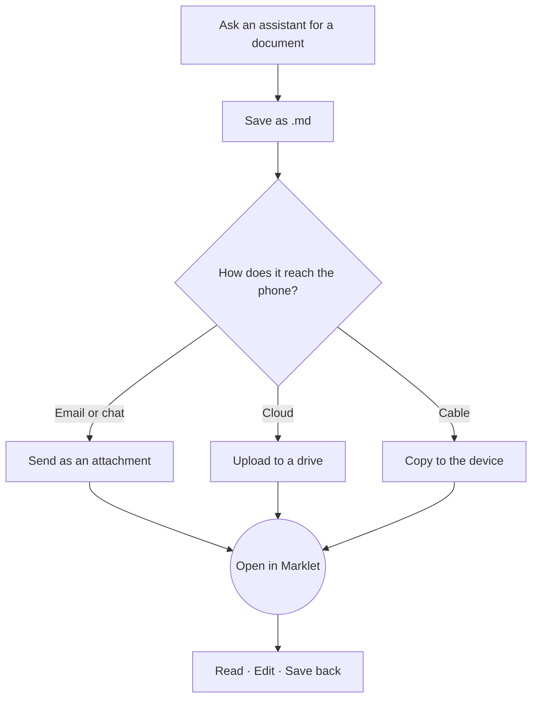
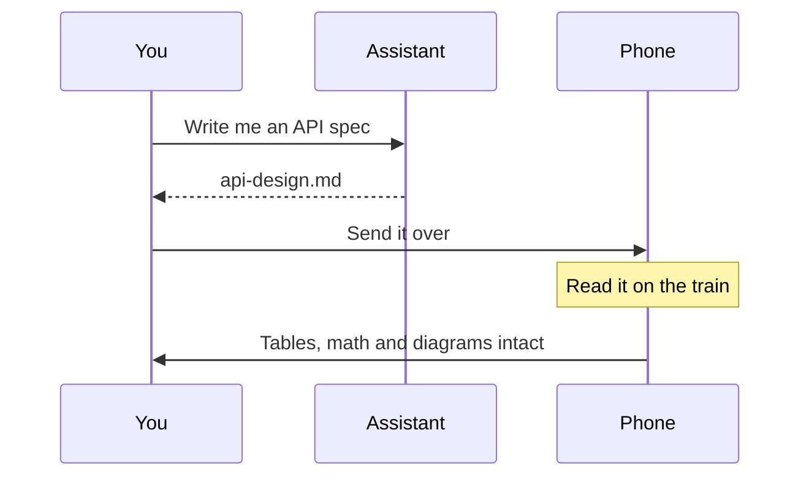

# Welcome to Marklet

This document is both a sample and the manual.
What you are looking at right now is how Marklet renders a file.
If the writer pressed Enter between sentences, **the line breaks stay where they were put.**

Scroll down and try things as you go. This file is read-only, so nothing you tap can break it.

---

## 1. Four ways to open a document

| Way              | How                                                                                                              |
| ---------------- | ---------------------------------------------------------------------------------------------------------------- |
| From another app | Tap a `.md` file in a file manager, a messenger, or an email client — Marklet appears in the list                |
| Open file        | Use **[Open file]** on the start screen to pick any file on the device                                           |
| Recent           | Anything you have opened stays on the start screen                                                               |
| **Folders**      | Add a folder once and every Markdown file inside it is listed — including files you add later from your computer |

> **A few apps need one extra step.**
> Google Drive and some messengers show their own preview first. Use the `⋮` menu and choose
> **Open with** to hand the file to Marklet.
> If you do this often, adding the folder under **Folders** is much quicker.

---

## 2. Diagrams are drawn, not dumped

Ask an assistant for a design and this is the format it answers in. Most viewers leave it as a grey block of code.



Sequences are drawn too.



If a diagram is wider than the screen, **swipe it sideways.**

---

## 3. Wide tables are not cut off

A table with many columns scrolls sideways instead of being clipped at the edge of the screen. Try dragging the one below to the left.

| Field    | Type    | Required | Default     | Range       | Unit     | Description          | Since | Deprecated | Notes                        |
| -------- | ------- | -------- | ----------- | ----------- | -------- | -------------------- | ----- | ---------- | ---------------------------- |
| `page`   | integer | no       | `1`         | 1–9999      | page     | Page number to fetch | 1.0.0 | —          | Counts from 1                |
| `size`   | integer | no       | `20`        | 1–100       | items    | Items per page       | 1.0.0 | —          | Values above 100 are clamped |
| `sort`   | string  | no       | `createdAt` | —           | —        | Field to sort by     | 1.0.0 | —          | Comma-separated for several  |
| `order`  | string  | no       | `desc`      | asc, desc   | —        | Sort direction       | 1.0.0 | —          | Case-insensitive             |
| `query`  | string  | no       | —           | 1–200 chars | —        | Search term          | 1.1.0 | —          | Matches the document body    |
| `from`   | date    | no       | —           | —           | ISO 8601 | Start of the range   | 1.2.0 | —          | Inclusive                    |
| `to`     | date    | no       | —           | —           | ISO 8601 | End of the range     | 1.2.0 | —          | Inclusive                    |
| `legacy` | boolean | no       | `false`     | —           | —        | Old response shape   | 1.0.0 | 2.0.0      | Do not use                   |

---

## 4. Math renders as math

Inline formulas sit inside the sentence — the area of a circle is $A = \pi r^2$, and the standard deviation is $\sigma = \sqrt{\frac{1}{n}\sum_{i=1}^{n}(x_i - \mu)^2}$.

Display formulas get their own line, centred and larger.

$$
\int_{0}^{1} x^2 \, dx = \left[ \frac{x^3}{3} \right]_{0}^{1} = \frac{1}{3}
$$

$$
f(n) = \begin{cases}
n/2 & \text{if } n \text{ is even} \\
3n + 1 & \text{if } n \text{ is odd}
\end{cases}
$$

---

## 5. Task lists and lists

Checkboxes are drawn as boxes. They are read-only in this sample.[^1]

- [x] Open a document by tapping it
- [x] Drag a table sideways
- [ ] Jump somewhere using the table of contents
- [ ] Make the text larger
- [ ] Switch to the dark theme

Numbered and nested lists keep their shape.

1. Open the file
2. Read it
    - Tables scroll
    - Diagrams are drawn
3. Fix something if you need to
    1. Tap **[Edit]** at the top right
    2. Make the change and tap **[Save]**
    3. It is written back to the original file[^2]

---

## 6. Code blocks are highlighted per language

Alignment holds even when comments contain wide characters.

```typescript
// Open a document and render it
async function openDocument(uri: string): Promise<void> {
    const doc = await MdFile.read({ uri }); // read the original as-is
    if (doc.size > MAX_RENDER_BYTES) {
        showRawMode(doc.content); // too large — show the source
        return;
    }
    render(doc.content);
}
```

```python
# Pull the headings out of a Markdown document to build a table of contents
def extract_headings(source: str) -> list[tuple[int, str]]:
    headings = []
    for line in source.splitlines():
        if line.startswith("#"):
            level = len(line) - len(line.lstrip("#"))   # hashes give the level
            headings.append((level, line.lstrip("# ").strip()))
    return headings
```

```bash
# Copy a Markdown file off the phone
adb pull /sdcard/Download/api-design.md ./     # one file
adb shell ls /sdcard/Download/*.md            # just list them
```

---

## 7. Finding your way around a long document

| Button | What it does                                                                              |
| ------ | ----------------------------------------------------------------------------------------- |
| `≡`    | **Contents.** A list of headings — tap one to jump there                                  |
| `⌕`    | **Find.** Search inside the document, with next and previous                              |
| `Edit` | Edit the original file in place                                                           |
| `⋮`    | **Reading options** (eight text sizes · light and dark) · Open another · Share · Settings |

Sharing lives under `⋮` and comes in three forms. They differ in what the other person receives.

| Share as        | What the other person gets                        |
| --------------- | ------------------------------------------------- |
| File            | The `.md` file itself — opens in any Markdown app |
| Plain text      | Readable text with the markup stripped out        |
| Markdown source | The raw text, with `#` and `*` still in it        |

---

## 8. Editing does not lose your file

Marklet's saving rules are three lines long.

1. **It writes back to the file you opened.** No copy is made and no number is appended to the name.
2. **If a save fails you are told.** It never fails quietly.
3. **Leaving with unsaved changes asks first.** Your text survives even if the app is closed.

> This sample lives inside the app, so **no [Edit] button appears.**
> Open a real `.md` file from your device and you will see it at the top right.

---

## 9. What Marklet does not do

Worth being straight about. None of these are planned.

- Creating new documents inside the app — a document is always a file that already exists on your device
- Accounts, sign-in, cloud sync — there is no server
- Renaming, deleting or moving files — that is a file manager's job
- Ads — there are none

**Reading, rendering and saving all happen on your device.** Nothing is sent anywhere.

---

Enjoy.
There is an optional tip in Settings if this saves you time. Nothing is taken away if you never use it.

[^1]: Open a real document in the editor and you can change `- [ ]` to `- [x]` yourself.

[^2]: If the file sits in a read-only location, Marklet offers **Save as** instead.
