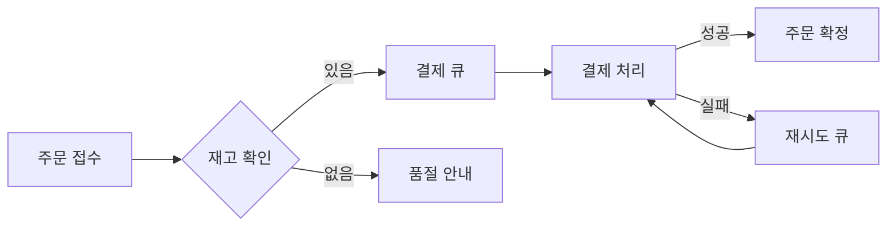

# 주문 서비스 개편 제안서

AI가 정리해 준 초안을 **받은 그대로** 읽어 보는 예시 문서입니다. 모든 이름과 숫자는 가상의 값입니다.
핵심은 하나입니다 — 주문이 몰려도 **결제 대기 시간을 1초 아래**로 유지하는 것.

## 1. 현황과 목표

지금은 주문, 재고, 결제가 한 서버 안에서 순서대로 처리됩니다. 한 단계가 느려지면 뒤의 모든 요청이 같이 기다립니다.

| 구분 | 현재 | 목표 | 비고 |
| :--- | ---: | ---: | :--- |
| 평균 응답 시간 | 1,840 ms | 600 ms | 결제 단계 포함 |
| 피크 처리량 | 120 req/s | 500 req/s | 점심·저녁 시간대 |
| 월 장애 시간 | 47분 | 5분 이하 | 재시도 큐 도입 |
| 배포 소요 | 35분 | 8분 | 서비스 분리 후 |

> 목표 수치는 지난 분기 부하 시험의 상위 5% 구간을 기준으로 잡았습니다.[^1]

## 2. 제안하는 구조

주문을 받는 일과 결제를 끝내는 일을 **큐로 분리**합니다. 사용자는 접수 응답을 바로 받고, 결제는 뒤에서 끝납니다.



큐가 비는 속도는 처리기 수에 비례합니다. 평균 대기 시간은 다음처럼 근사합니다.

$$W = \frac{1}{\mu - \lambda}, \qquad \rho = \frac{\lambda}{\mu} < 1$$

여기서 $\lambda$ 는 초당 도착 건수, $\mu$ 는 초당 처리 건수입니다. $\rho$ 가 1에 가까워지면 대기가 급격히 늘어납니다.

## 3. 핵심 코드

재시도는 지수 백오프로 간격을 벌립니다. 실패한 결제가 한꺼번에 몰리지 않게 하려는 것입니다.

```ts
async function retryPayment(job: PaymentJob, attempt = 1): Promise<void> {
  try {
    await gateway.charge(job.orderId, job.amount);
  } catch (err) {
    if (attempt >= MAX_ATTEMPTS) throw err;
    const delay = Math.min(2 ** attempt * 200, 10_000);
    await sleep(delay + Math.random() * 100); // 지터
    return retryPayment(job, attempt + 1);
  }
}
```

## 4. 일정

| 단계 | 기간 | 산출물 |
| :--- | :--- | :--- |
| 설계 확정 | 1주 | 구조도, 큐 설정안 |
| 큐·처리기 구현 | 3주 | 결제 큐, 재시도 정책 |
| 부하 시험 | 1주 | 시험 보고서 |
| 단계적 전환 | 2주 | 10% → 50% → 100% |

## 5. 위험과 대응

- **중복 결제** — 주문 번호를 멱등 키로 쓰고, 처리기가 같은 키를 두 번 처리하지 않게 합니다.
- **큐 유실** — 디스크에 보존하고, 하루 한 번 미처리 건수를 점검합니다.
- **전환 중 불일치** — 전환 기간에는 양쪽 결과를 비교해 달라지는 건을 기록합니다.

## 6. 체크리스트

- [x] 현황 수치 수집
- [x] 큐 방식 비교
- [ ] 보안 검토 요청
- [ ] 부하 시험 환경 확보
- [ ] 전환 일정 합의

## 7. 결정이 필요한 것

1. 결제 실패 알림을 **즉시** 보낼지, 재시도가 끝난 뒤 보낼지
2. 접수 응답에 **예상 완료 시각**을 보여 줄지
3. 첫 전환 대상을 어느 매장군으로 할지

[^1]: 부하 시험은 평일 18시 기준 30분 구간, 동시 접속 800명으로 진행했다고 가정한 값입니다.
