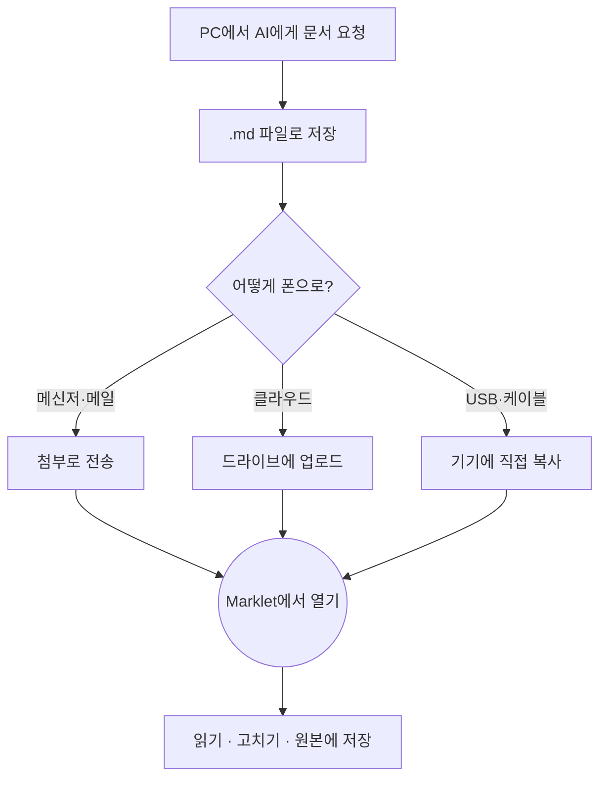
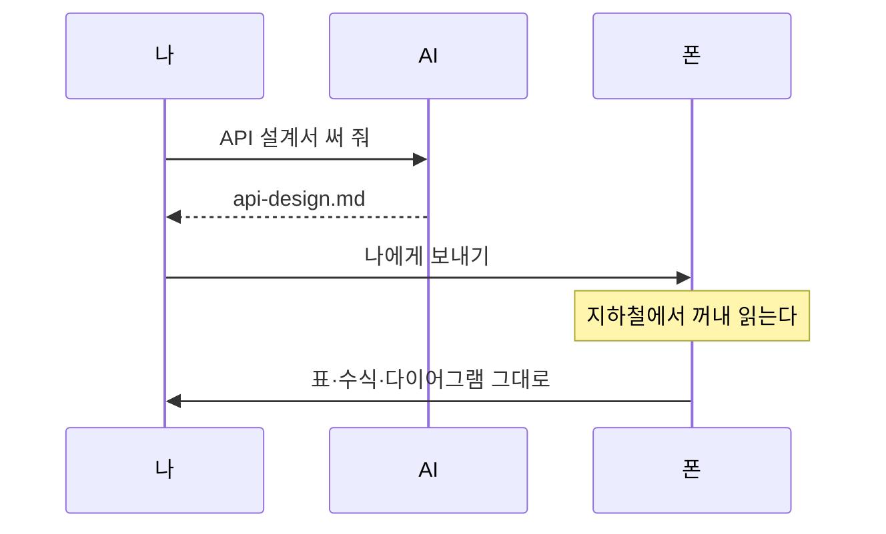

# Marklet에 오신 것을 환영합니다

이 문서는 예제이자 사용 설명서입니다.
지금 보고 계신 이 화면이 Marklet이 문서를 그리는 방식입니다.
문장마다 엔터를 쳤다면, 보시는 것처럼 **줄이 그대로 바뀝니다.**

읽어 내려가시면서 하나씩 눌러 보세요. 이 문서는 읽기 전용이라 무엇을 눌러도 망가지지 않습니다.

---

## 1. 문서를 여는 네 가지 방법

| 방법 | 어떻게 |
|---|---|
| 다른 앱에서 | 파일 관리자·메신저·메일에서 `.md` 파일을 누르면 Marklet이 후보에 뜹니다 |
| 파일 열기 | 시작 화면의 **[파일 열기]** 로 기기 어디에 있는 파일이든 고릅니다 |
| 최근 문서 | 한 번 연 문서는 시작 화면에 남습니다 |
| **내 폴더** | 폴더를 한 번 등록해 두면 그 안의 `.md` 가 목록에 뜹니다. PC에서 나중에 넣은 파일도 자동으로 나타납니다 |

> **카카오톡·Google 드라이브에서는 한 단계가 더 필요합니다.**
> 두 앱은 자체 미리보기를 먼저 띄웁니다. `⋮` 메뉴에서 **다른 앱으로 열기** 또는
> **연결 프로그램**을 고르시면 Marklet으로 넘어옵니다.
> 자주 쓰신다면 **내 폴더**에 등록해 두는 쪽이 훨씬 빠릅니다.

---

## 2. 다이어그램이 그림으로 그려집니다

AI에게 설계를 부탁하면 이런 형식으로 답을 줍니다. 다른 뷰어에서는 회색 코드 덩어리로 보이는 부분입니다.



순서를 나타내는 그림도 그려집니다.



다이어그램이 화면보다 넓으면 **좌우로 밀어서** 보실 수 있습니다.

---

## 3. 표는 잘리지 않습니다

열이 많은 표는 화면 끝에서 잘리는 대신 **좌우로 스크롤됩니다.** 아래 표를 왼쪽으로 밀어 보세요.

| 항목 | 형식 | 필수 | 기본값 | 범위 | 단위 | 설명 | 도입 버전 | 사용 중단 | 비고 |
|---|---|---|---|---|---|---|---|---|---|
| `page` | 정수 | 아니오 | `1` | 1~9999 | 쪽 | 조회할 쪽 번호 | 1.0.0 | — | 1부터 셉니다 |
| `size` | 정수 | 아니오 | `20` | 1~100 | 건 | 한 쪽에 담을 건수 | 1.0.0 | — | 100을 넘기면 잘립니다 |
| `sort` | 문자열 | 아니오 | `createdAt` | — | — | 정렬 기준 필드 | 1.0.0 | — | 쉼표로 여러 개 |
| `order` | 문자열 | 아니오 | `desc` | asc, desc | — | 정렬 방향 | 1.0.0 | — | 대소문자 구분 없음 |
| `query` | 문자열 | 아니오 | — | 1~200자 | — | 검색어 | 1.1.0 | — | 초성도 됩니다 |
| `from` | 날짜 | 아니오 | — | — | ISO 8601 | 조회 시작일 | 1.2.0 | — | 이 날짜를 포함합니다 |
| `to` | 날짜 | 아니오 | — | — | ISO 8601 | 조회 종료일 | 1.2.0 | — | 이 날짜를 포함합니다 |
| `legacy` | 참/거짓 | 아니오 | `false` | — | — | 구버전 응답 형식 | 1.0.0 | 2.0.0 | 쓰지 마세요 |

---

## 4. 수식도 수식으로 보입니다

본문 속 수식은 이렇게 문장 안에 섞입니다 — 원의 넓이는 $A = \pi r^2$ 이고, 표준편차는 $\sigma = \sqrt{\frac{1}{n}\sum_{i=1}^{n}(x_i - \mu)^2}$ 입니다.

별도의 줄에 쓴 수식은 가운데 큼직하게 그려집니다.

$$
\int_{0}^{1} x^2 \, dx = \left[ \frac{x^3}{3} \right]_{0}^{1} = \frac{1}{3}
$$

$$
f(n) = \begin{cases}
n/2 & n \text{이 짝수일 때} \\
3n + 1 & n \text{이 홀수일 때}
\end{cases}
$$

---

## 5. 체크박스와 목록

할 일 목록은 네모로 그려집니다. 이 문서에서는 읽기 전용입니다.[^1]

- [x] 문서를 눌러서 연다
- [x] 표를 좌우로 밀어 본다
- [ ] 목차 버튼으로 이동해 본다
- [ ] 글자 크기를 키워 본다
- [ ] 다크 모드로 바꿔 본다

번호가 붙은 목록과 중첩도 그대로 나옵니다.

1. 문서를 연다
2. 읽는다
   - 표는 밀어서
   - 다이어그램은 그림으로
3. 필요하면 고친다
   1. 우상단 **[편집]**
   2. 고치고 **[저장]**
   3. 원본 파일에 그대로 덮어써집니다[^2]

---

## 6. 코드는 언어별로 색이 다릅니다

한글 주석이 섞여 있어도 줄이 어긋나지 않습니다.

```typescript
// 문서를 열어 화면에 그린다
async function openDocument(uri: string): Promise<void> {
    const doc = await MdFile.read({ uri });   // 원본을 그대로 읽는다
    if (doc.size > MAX_RENDER_BYTES) {
        showRawMode(doc.content);             // 너무 크면 원문으로
        return;
    }
    render(doc.content);
}
```

```python
# 마크다운 문서에서 제목만 뽑아 목차를 만든다
def extract_headings(source: str) -> list[tuple[int, str]]:
    headings = []
    for line in source.splitlines():
        if line.startswith("#"):
            level = len(line) - len(line.lstrip("#"))   # 샵 개수가 곧 단계
            headings.append((level, line.lstrip("# ").strip()))
    return headings
```

```bash
# 폰에 있는 마크다운 파일을 PC로 꺼내기
adb pull /sdcard/Download/api-design.md ./     # 파일 하나
adb shell ls /sdcard/Download/*.md            # 목록만 보기
```

---

## 7. 긴 문서에서 길을 잃지 않으려면

| 버튼 | 하는 일 |
|---|---|
| `≡` | **목차.** 제목 목록이 뜨고, 누르면 그 자리로 갑니다 |
| `⌕` | **검색.** 문서 안에서 단어를 찾습니다. `ㅁㅋㄷㅇ` 처럼 **초성만 쳐도 찾습니다** |
| `Aa` | **보기 설정.** 글자 크기 여덟 단계, 밝은/어두운 테마 |
| `⋮` | 편집 · 공유 · 원문 보기 · 설정 |

**원문 보기**를 누르면 지금 화면과 마크다운 원문을 오갈 수 있습니다. 이 문서가 실제로 어떻게 쓰여 있는지 궁금하시면 눌러 보세요.

---

## 8. 고쳐도 파일이 사라지지 않습니다

Marklet의 저장 규칙은 세 줄입니다.

1. **열었던 그 파일에 그대로 덮어씁니다.** 사본을 만들지 않고 이름 뒤에 숫자를 붙이지 않습니다.
2. **저장에 실패하면 반드시 알려드립니다.** 조용히 넘어가지 않습니다.
3. **저장하지 않고 나가려 하면 물어봅니다.** 앱이 갑자기 닫혀도 쓰던 내용이 남습니다.

> 이 예제 문서는 앱 안에 들어 있어 **편집 버튼이 나타나지 않습니다.**
> 기기에 있는 실제 `.md` 파일을 열면 우상단에 **[편집]** 이 보입니다.

---

## 9. Marklet이 하지 않는 것

솔직하게 적어 둡니다. 아래는 앞으로도 만들지 않습니다.

- 앱 안에서 새 문서 만들기 — 문서는 항상 기기에 이미 있는 파일입니다
- 계정 · 로그인 · 클라우드 동기화 — 서버가 없습니다
- 파일 이름 바꾸기 · 삭제 · 이동 — 파일 관리자의 일입니다
- 광고 — 넣지 않습니다

**문서를 읽고, 그리고, 저장하는 모든 일이 이 기기 안에서 끝납니다.** 어떤 내용도 밖으로 나가지 않습니다.

---

즐겁게 읽으세요.
설정 화면에서 개발자에게 커피 한 잔 사 주실 수도 있습니다. 하지만 그러지 않으셔도 빠지는 기능은 하나도 없습니다.

[^1]: 실제 문서를 편집 화면에서 열면 `- [ ]` 를 `- [x]` 로 직접 고쳐 저장하실 수 있습니다.
[^2]: 읽기 전용 위치에 있는 파일이라면 **다른 이름으로 저장**을 안내해 드립니다.
